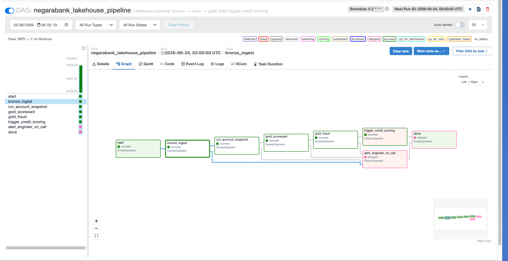

# SemestaBank Data Platform — Level-2 Data Engineer Assessment

**Single, self-contained answer to the Insignia (AWS BU) Data Engineer take-home.**
Everything you need to evaluate the three questions — runnable code, SQL, architecture,
and the reasoning behind each decision — lives in this folder, organized as a small wiki.

> **Scenario in one line:** SemestaBank is an Indonesian digital-first bank (4.2M customers,
> 2M+ txns/day, 50K clickstream events/sec) under an OJK mandate to demonstrate data
> lineage and auditability. You fix a broken nightly ELT (Q1), build regulatory SQL views
> (Q2), and design the end-to-end platform (Q3).

---

## 🔑 Two conditions, one codebase

Every runnable artifact is delivered in **two forms**, exactly as requested:

| | **① Local** — runs on a laptop | **② Production** — AWS / Databricks, company-grade |
|---|---|---|
| **Where** | [`local/`](local/) | [`production/`](production/) + [`architecture/`](architecture/) |
| **Stack** | Docker: PostgreSQL + MinIO + Spark + Airflow | Oracle + S3/Delta + Databricks/EMR + Unity Catalog + MSK |
| **Purpose** | Reproduce and verify the answers in minutes, free | Show how it scales to a $50K/mo regulated bank platform |
| **Guide** | [docs/06_Local_Run_Guide.md](docs/06_Local_Run_Guide.md) | [docs/07_Production_AWS_Databricks.md](docs/07_Production_AWS_Databricks.md) |

The **business logic is identical** across both — only the edges (storage, secrets, compute,
orchestration) swap. That portability is itself a design goal (see Q1 and Q3).

---

| Path | What happens |
|------|--------------|
| `CSV → PG → BRONZE` | `init.sql` loads CSVs into Postgres; `bronze_ingest.py` reads via JDBC → MinIO Parquet with PII masking |
| `BRONZE → SILVER` | `backfill_snapshot.py` (default): all historical dates in one pass. `account_snapshot.py` (nightly): single date with DQ/KYC/OJK gates |
| `BRONZE + SILVER → GOLD scorecard` | `gold_scorecard.py` needs silver `prev_month_balance` CTE — the MoM LAG reads prior month-end from `silver.account_snapshots` |
| `BRONZE → GOLD fraud` | `gold_fraud.py` reads bronze only (no silver dependency); `RANGE`/`ROWS` windows + merchant_locations join |
| Part B | Independent PostgreSQL-native SQL path — same logic, different engine. Run it standalone or compare against Part A output |


> **Production architecture diagram:** [`architecture/semestabank_platform.html`](architecture/semestabank_platform.html) — open in browser for the full Databricks + AWS platform layout with sources, ingestion, medallion, engines, serving, and governance layers. Also available as [ASCII diagram in ARCHITECTURE.md](architecture/ARCHITECTURE.md).

---

## 🗺️ The wiki — start here

| Page | What it covers |
|------|----------------|
| [01 · Scenario & Dataset](docs/01_Scenario_and_Dataset.md) | SemestaBank context, the 7-table schema, dataset stats, OJK rules |
| [02 · Evaluation Criteria Map](docs/02_Evaluation_Criteria_Map.md) | Every rubric line → the exact artifact that satisfies it |
| [03 · Q1 — Pipeline Optimization](docs/03_Q1_Pipeline_Optimization.md) | 8 problems + fixes, the production rewrite, orchestration/SLA |
| [04 · Q2 — Regulatory SQL](docs/04_Q2_Regulatory_SQL.md) | Health scorecard, fraud detection, materialization strategy |
| [05 · Q3 — Platform Architecture](docs/05_Q3_Platform_Architecture.md) | Architecture diagram, 50K/sec streaming, lineage, $50K budget |
| [06 · Local Run Guide](docs/06_Local_Run_Guide.md) | Step-by-step end-to-end run **+ verified smoke-test results** |
| [07 · Production (AWS/Databricks)](docs/07_Production_AWS_Databricks.md) | Deploy runbook + local→prod mapping for every component |
| [08 · Concepts & Deep Dives](docs/08_Concepts_Deep_Dives.md) | Window functions, incremental loading, idempotency, lineage — the "why" |

---

## 📁 Repository layout

```
Final_Answer/
├── README.md                 ← you are here (wiki home)
├── docs/                     ← the wiki (8 pages above)
├── local/                    ← CONDITION ① runnable on a laptop
│   ├── q1_pipeline/          ← Docker stack: Postgres + MinIO + Spark + Airflow
│   └── q2_sql/               ← PostgreSQL regulatory views + seeds
├── production/               ← CONDITION ② AWS/Databricks design + runnable stubs
│   ├── databricks/           ← Delta job, DLT views, Workflows JSON
│   ├── aws/                  ← EMR Serverless, Step Functions, MWAA, SNS
│   └── terraform/            ← IaC skeleton (illustrative)
└── architecture/             ← Q3 platform design docs + ASCII diagrams
```

> **Note on the dataset:** the 237 MB `semestabank_dataset/` (CSV inputs) is **not** duplicated
> here — it lives at the repo root and the local Docker stack mounts it by relative path.
> See the Local Run Guide.

---

## ⚡ 60-second quickstart (local)

```bash
cd Final_Answer/local/q1_pipeline
cp .env.example .env
docker compose up -d                 # Postgres (loads ~2M txns) + MinIO + buckets
docker compose --profile run up spark # bronze → silver → gold, end-to-end
```

Then explore the Q2 regulatory views directly in Postgres — full commands and **expected
output** are in the [Local Run Guide](docs/06_Local_Run_Guide.md).

### Airflow orchestration



The DAG runs `bronze_ingest → account_snapshot → gold_scorecard → gold_fraud` nightly at 02:00 with 3 retries, 30-min SLA on silver, and Slack/email alerting on exhaustion. Access at `http://localhost:8080` (admin / admin) with `docker compose --profile orchestrate up airflow`.

---

## ✅ Evaluation at a glance

- **Pipeline Design** — incremental loading, secret management, partitioning, DQ assertions,
  idempotency, retries/SLA/alerts. → [Q1](docs/03_Q1_Pipeline_Optimization.md)
- **SQL Proficiency** — CTEs, `LAG`, `RANGE`/`ROWS` windows, conditional aggregation,
  incremental materialization. → [Q2](docs/04_Q2_Regulatory_SQL.md)
- **Architecture Thinking** — medallion lakehouse, 50K/sec streaming, hot/warm/cold tiering,
  column-level lineage, budget engineering, explicit trade-offs. → [Q3](docs/05_Q3_Platform_Architecture.md)
- **Explanation** — the reasoning is documented throughout; the
  [Concepts](docs/08_Concepts_Deep_Dives.md) page and per-question docs make the thought
  process explicit.
